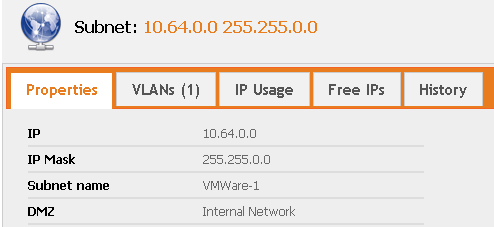
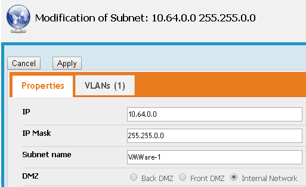

# iTop-DMZ-for-Subnets

# Goal
Just add a radio button in subnet, named DMZ, with three choices : front / back / internal

# Description
This is a very personal extention, probably useless for everyone else. We have hundred of networks and sometimes, we forget were they belongs. So, in that case, it's convenient to know if a specific network is 
* In DMZ front (very exposed)
* In DMZ Back (less exposed)
* In internal Network (supposely a safe place :))

Plugin in the normal view

Plugin in the edit view

# Installation

As for all my extentions, just download the zip file, and copy the 'schirrms-...' directory in your extensions directory, then rerun the setup as usual.
